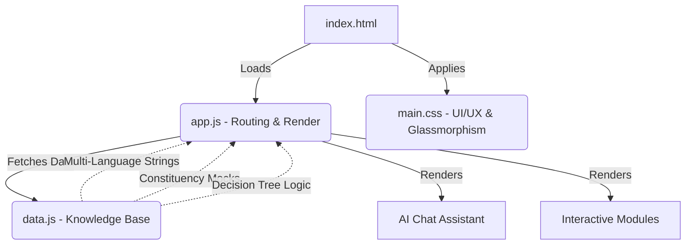
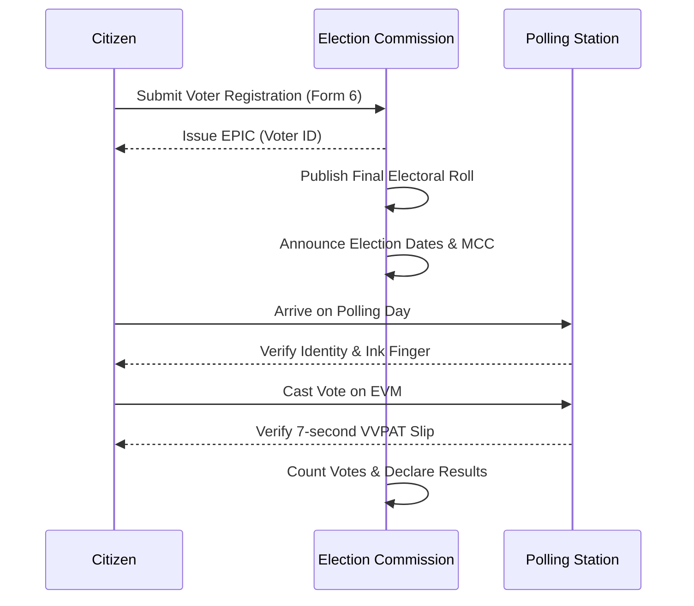

# 🇮🇳 Bharat Nirvachan Assistant

The **Bharat Nirvachan Assistant** is a premium, highly interactive, and multilingual web application designed to educate Indian citizens about the democratic election process. Built with a modern glassmorphism aesthetic, it serves as a one-stop digital hub for voter education, simulated interactions, and civic engagement.

 *(Note: Ensure an asset exists or replace with actual screenshot if available)*

## ✨ Key Features
- **Smart AI Assistant**: A context-aware chatbot with "Never-Say-No" logic and persona-based dynamic responses (Student, First-Time Voter, General Citizen).
- **Interactive Election Timeline**: A vivid visualization of the 5 main phases of the Indian election process.
- **Constituency Finder**: PIN-code-based lookup demonstrating candidates and symbols (e.g., searches for Delhi, Mumbai, Hyderabad, Pune, Lucknow).
- **EVM / VVPAT Simulator**: An interactive educational simulation of casting a vote and verifying the VVPAT slip.
- **Voter Statistics**: Beautiful, CSS-animated donut charts and historical turnout comparison graphs.
- **Mock Digital Voter Slip Generation**: Generate a customized voter slip with a QR code and photo upload.
- **National Voter Pledge**: Sign and generate a printable commitment certificate.
- **Bilingual Support**: Fully togglable between **English** and **Hindi**.

---

## 🏗️ System Architecture

The project is built entirely on a lightweight **Vanilla Web Stack**, ensuring incredibly fast load times and no hefty dependencies. It features a centralized data-driven approach.



## 🔄 The Election Lifecycle

The application teaches citizens about the multi-phased approach utilized by the Election Commission of India (ECI):



---

## 🛠️ Tech Stack
*   **HTML5**: Semantic document structure.
*   **CSS3**: Advanced features like `backdrop-filter` for glassmorphism, flexbox/grid for responsive layouts, and CSS keyframe animations.
*   **Vanilla JavaScript (ES6)**: State management, DOM manipulation, routing, and simulation logic all done without external frameworks.
*   **Web Speech API**: Text-to-speech for accessibility.

## 🚀 Deployment (Cloud Run)

This project has been Dockerized and is built for deployment on **Google Cloud Run** using a high-performance **Nginx** alpine image.

### Deployment Instructions:
1. Ensure the **Google Cloud SDK** (`gcloud`) is installed locally.
2. Open PowerShell in the project root.
3. Authenticate and set the target project:
   ```powershell
   gcloud auth login
   gcloud config set project elec-prompt-1
   ```
4. Execute the deployment script:
   ```powershell
   .\deploy.ps1
   ```

## 🤝 Contributing
Contributions are always welcome! Feel free to raise an issue, suggest architectural improvements, or submit a Pull Request.
